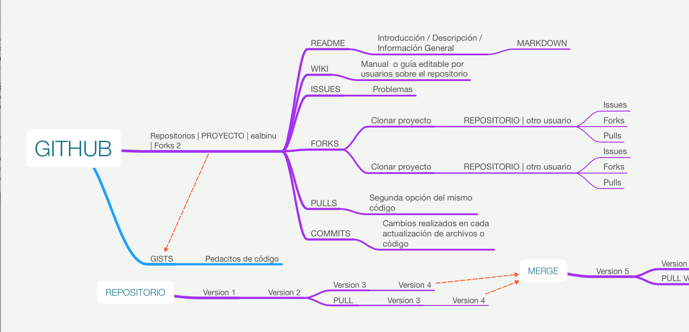

## PI-2017-1

# Desarrollo web (Materia: Hojas de estilo para sitios web)

**Proyecto Integrador 2017-1 [Septiembre - Enero]**

---

## Calendario del cuatrimestre 

| Concepto                 | Fecha                 |
| ------------------------ | --------------------- |
| ~~1er. evaluación~~      | ~~Octubre 19~~        |
| ~~2nda. evaluación~~     | ~~Noviembre 23~~      |
| Semana de ensayos        | Diciembre 5-10        |
| Vacaciones               | Diciembre 5 - Enero 1 |
| Semana retroalimentación | Enero 11              |
| Presentación             | Enero 14              |

---

## Asistencias

| Alumno       |         s1         |     s2     |     s3     |   s4   |  s5  |         s6         |     s7      |     s8     |     s9     |  s10   | s11  |    s12     | s13  |     s14     | s15  |
| ------------ | :----------------: | :--------: | :--------: | :----: | :--: | :----------------: | :---------: | :--------: | :--------: | :----: | :--: | :--------: | :--: | :---------: | :--: |
| **Rafa**     |      :bowtie:      | :laughing: | :relieved: | :wink: |  😀  | :stuck_out_tongue: | :grimacing: | :laughing: | :relieved: |   😉   |  😀  | :laughing: |  😉  | :grimacing: |  -   |
| **Diana**    |     :laughing:     | :laughing: | :relieved: | :wink: |  😀  | :stuck_out_tongue: | :grimacing: | :laughing: | :relieved: | :wink: |  😀  | :laughing: |  😉  | :grimacing: |  -   |
| **Valeria**  |     :relieved:     | :laughing: | :relieved: | :wink: |  😀  | :stuck_out_tongue: | :grimacing: | :laughing: | :relieved: | :wink: |  😀  | :laughing: |  😉  |      -      |  -   |
| **César**    |       :wink:       | :laughing: | :relieved: | :wink: |  😀  | :stuck_out_tongue: | :grimacing: | :laughing: | :relieved: | :wink: |  😀  | :laughing: |  😉  | :grimacing: |  -   |
| **Adriana**  |         😀         | :laughing: | :relieved: | :wink: |  😀  | :stuck_out_tongue: | :grimacing: | :laughing: | :relieved: | :wink: |  😀  | :laughing: |  😉  | :grimacing: |  -   |
| **Itzel**    |         -          | :laughing: | :relieved: |   -    |  😀  | :stuck_out_tongue: | :grimacing: | :laughing: | :relieved: | :wink: |  😀  | :laughing: |  😉  | :grimacing: |  -   |
| **Jonathan** | :stuck_out_tongue: | :laughing: | :relieved: | :wink: |  😀  | :stuck_out_tongue: | :grimacing: | :laughing: | :relieved: | :wink: |  😀  | :laughing: |  😉  | :grimacing: |  -   |
| **Ian**      |    :grimacing:     | :laughing: | :relieved: | :wink: |  😀  |         -          | :grimacing: | :laughing: | :relieved: | :wink: |  😀  | :laughing: |  😉  | :grimacing: |  -   |
| **Octavio**  |         -          | :laughing: | :relieved: | :wink: |  😀  | :stuck_out_tongue: | :grimacing: | :laughing: | :relieved: | :wink: |  -   | :laughing: |  😉  |      -      |  -   |

---

## Repositorios

| Alumno   | Repositorio                              | Sitio en vivo                            |
| -------- | ---------------------------------------- | ---------------------------------------- |
| Rafa     | https://github.com/IconosInstituto/Hambre-RafaelMitre29 |                                          |
| Diana    | https://github.com/IconosInstituto/PobrezaDiana | https://diana99hd.github.io/Sitiomuseomiseria.github.io/ |
| Valeria  | https://github.com/IconosInstituto/alimentos-Valeria | https://iconosinstituto.github.io/alimentos-Valeria/webeee/ |
| César    | https://github.com/IconosInstituto/contaminacion | https://cxrbrnrd.github.io/sitio_proyecto/ |
| Adriana  | https://github.com/IconosInstituto/Derechos-humanos-Adriana |                                          |
| Itzel    | https://github.com/IconosInstituto/MUSEODELAPOBLACION | https://iconosinstituto.github.io/MUSEODELAPOBLACION/ |
| Jonathan | https://github.com/IconosInstituto/La-Migraci-n-de-Jonhy/tree/master/migracion |                                          |
| Ian      | https://github.com/IconosInstituto/IanPobreza |                                          |
| Octavio  |                                          |                                          |

---

## ¿Cómo funciona Github?

---

## Guía de Markdown para Github

<https://guides.github.com/features/mastering-markdown/>

---

## Font Awesome

Listado de iconos: <http://fontawesome.io/icons/>

CDN: <https://cdnjs.cloudflare.com/ajax/libs/font-awesome/4.6.3/css/font-awesome.min.css>

---

## CDN's

<https://cdnjs.com/>

## Librería DW4.css

<https://github.com/DragonBarbudo/DW4Lib>

## Degradados CSS

<http://codepen.io/ealbinu/pen/JbProL>

## Position absolute / fixed / relative

<http://codepen.io/ealbinu/pen/qqWPdY?editors=1100>

## EMMET

Sintáxis : <http://codepen.io/ealbinu/pen/KNPXyW>

## Uso de Mediaqueries

Ejemplo de código: <https://gist.github.com/ealbinu/6fc4a019b8f5c148a5c886cf75c800e3>

