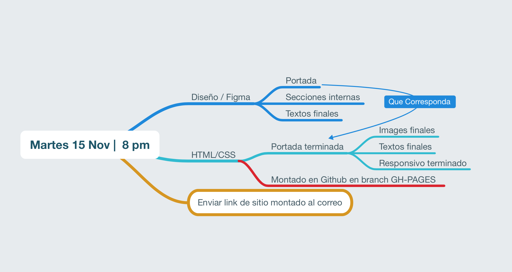

#Tareas

##Sesión 1

- Instalar Github y sincronizar proyecto
- Nombre de proyecto y estilo visual (agregar a README)
- Añadir mapa de sitio tentativo a "README".
- Crear carpeta en Repositorio de Github "UNIVERSO CREATIVO" con 3 imagenes de referencia de sitios web "similares".

##Sesión 2

- Header:HERO >  Convertir en un sitio informativo sobre su proyecto.
- Utilizar al menos 5 iconos.

## Sesión 6

* Utilizando el Framework Dw4 crear la portada del diseño en Figma.

## Sesión 8fa

